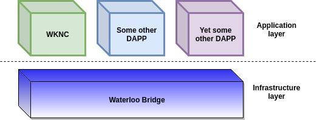

# Waterloo bridge ETH->EOS side

## Summary
Waterloo is a bi-directional ETH<->EOS decentralized relay bridge.  
For the EOS->ETH side, see https://github.com/KyberNetwork/bridge_eth_smart_contracts.

## Demo and Theory 
[Demo of relaying headers and issuing WKNC tokens](https://www.youtube.com/watch?v=GciXvqAQHAo)  
[Technical blog post](https://blog.kyber.network/waterloo-a-decentralized-practical-bridge-between-eos-and-ethereum-c25b1698f010)

## Layers and Roles
The Eth->EOS Waterloo bridge ecosystem is comprised of 2 layers, where each has one or more actor types:  
- Infrastructure layer:
    - Deployer - initially deploys the bridge.  
    - Relayers - relay block headers from the Ethereum chain. Each relayer runs a relay app.
- App layer:
    - Users - run user apps in order to use the bridge data. An example of such an app is the wknc app.  

## Build sub repositories and install packages
`bash scripts/build.sh`

## Relay App

One can use the relay app to relay Ethereum headers to EOSIO private netowrk/testnet/mainnet:  

1. Create 2 accounts - for the bridge and for a blocks relayer:  
For using existing accounts just set BRIDGE_ACCOUNT and RELAYER_ACCOUNT and skip the creation.
`BRIDGE_ACCOUNT=bridge`  
`BRIDGE_PUBLIC_KEY=EOS5CYr5DvRPZvfpsUGrQ2SnHeywQn66iSbKKXn4JDTbFFr36TRTX`  
`cleos create account eosio $BRIDGE_ACCOUNT $BRIDGE_PUBLIC_KEY`  
`RELAYER_ACCOUNT=relay`  
`RELAYER_PUBLIC_KEY=EOS5BVngJvx5Y1f4tdzK1bVykB79ps1ZRtDBvJo4d7kELvSta5ryN`  
`cleos create account eosio $RELAYER_ACCOUNT $RELAYER_PUBLIC_KEY`  

2. Compile and deploy the bridge contacts  
`bash scripts/compile_contracts.sh`  
`cleos set contract $BRIDGE_ACCOUNT contracts/Bridge Bridge.wasm --abi Bridge.abi -p $BRIDGE_ACCOUNT@active`

3. Create keypair files and a cfg file for the relay app. For example see references in scripts/local/relay_app_sample_input dir:  
	**deployer_keypair.json** - private and public key pair for the bridge contract.  
	**relayer_keypair.json** - private and public key pair for the relayer account.  
	**cfg.json** - configuration parameters for the bridge.

4. Run the relay app, pointing to your cfg file location. For example:  
`node apps/relay-app/relay-app.js --cfg scripts/local/relay_app_sample_input/cfg.json --genesis=8123001 --start=8123001 --end=8123306`

## WKNC sample app

The WKNC sample app demonstrates how to use the bridge. It uses the stored headers data in order to validate locking of tokens on an Ethereum contract and issuing equivalent tokens on the EOS side.

1. Create accounts and deploy contracts. See following example for a local testnet:  
`bash scripts/local/issue_bringup.sh`

2. For issuing tokens there are currently 2 options:

    - Run a script which identifies lock events and calls the wknc-app to issue tokens:  
`node apps/wknc-app/listen-for-lock.js`

    - Alternatively, call wknc-app manually after each lock event.  
      Issuing tokens is comprised of verifying a block and its receipt, as well as specifying the issue cmd:  
`node apps/wknc-app/wknc-app.js --cfg scripts/local/wknc_app_sample_input/cfg.json --blockVerify=8123247 --receiptVerify=0x47d76b0a9290ad65db9e33301e9f68c45c005942ebb4c7f91503424cc599fcbf --issue`